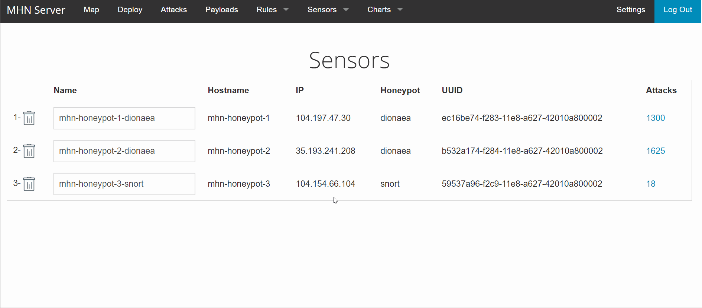
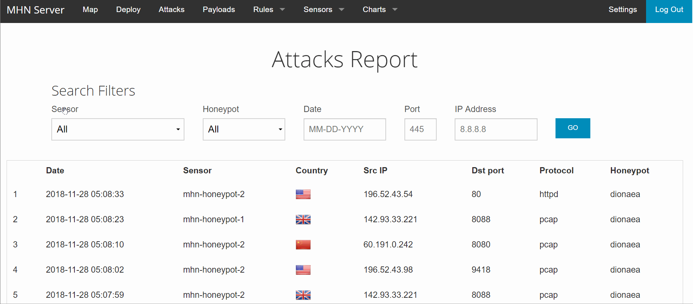
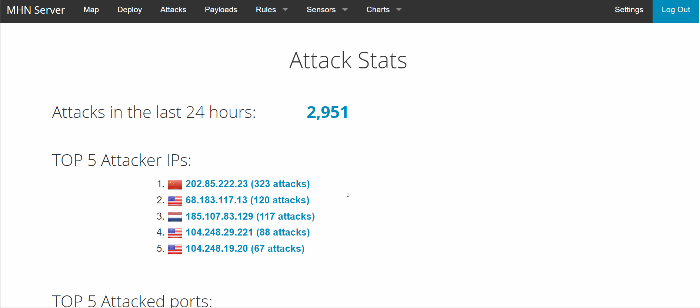
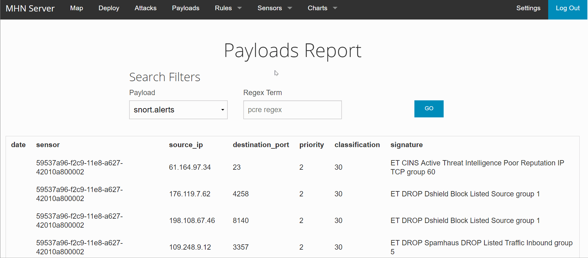

# CSc59938_Week9
# Project 9: Honey Pot
Time spent: 9 hours spent in total

## Deployed Honeypots
- mhn-honeypot-1 (dionea)
- mhn-honeypot-2 (dionea)
- mhn-honeypot-3 (snort)

## Summary of Data Collected
1. Sensors Deployed:

2. Attack Report:

3. Attack Stats:

4. Malware Samples:

## Any unresolved questions raised by the data collected
N/A

## Issues Encountered
Setting everything up just to access the website took a lot of time.

## Resources

GIFs created with [LiceCap](http://www.cockos.com/licecap/).

## License

    Copyright [2018] [Luis Bueno]

    Licensed under the Apache License, Version 2.0 (the "License");
    you may not use this file except in compliance with the License.
    You may obtain a copy of the License at

        http://www.apache.org/licenses/LICENSE-2.0

    Unless required by applicable law or agreed to in writing, software
    distributed under the License is distributed on an "AS IS" BASIS,
    WITHOUT WARRANTIES OR CONDITIONS OF ANY KIND, either express or implied.
    See the License for the specific language governing permissions and
    limitations under the License.
